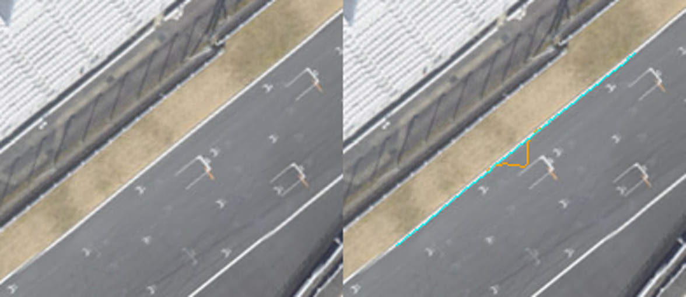

# 富士GPS・CG：原因追及と精度改善の実施結果（2026-09-22）

## 要旨

**確認できた実装上の誤差を修正し、両日・全10周を再生成・再推定・実ブラウザ検証まで完了した。** ラップ端の処理由来変位は最大4.928mから0.0316mへ、実描画での道路外超過時間は7/29の4周合計24.2→3.7秒、7/30の6周合計51.8→6.5秒になった。後二者は「今回の入力で元GPSと位置合わせを比べた値」で、真のGPS位置誤差ではない。

修正後もセッション間の推定差は**4.821m**。両日でアンテナが同じという情報と整合し、固定の車両寸法や地図の位置ずれだけではこの日差を説明できない。ただし真位置を測ったものではなく、GPS側のセッション差・実際の走行ライン・路面利用条件等を完全に分離したとは言えない。地図の共通偏りも未確定である。

映像とラップタイマーはおおむね整合する。一方、ログ内のGPS・車輪速度に見かけの時間差があり、カメラも距離計測用には未校正だった。**旧文書の「地図絶対誤差1m以下」「映像距離±0.5m」「GPS08と断定」「映像概算からアンテナ横位置を決められる」という解釈は撤回する。** 現時点では、修正済み入力のラップ単位平行移動を使い、根拠のない時刻移動・地点別補正は追加しない。

## 実施した修正と根拠

| 対象 | 修正 | 検証結果・意味 |
|---|---|---|
| ラップ端GPS | 隣接ラップの連続するGPSを前後2点読み、境界でも対称5点平均。欠測・異常な隣接点は混ぜない | 全10周の先頭2点・末尾2点、計40点のみ変更。元10Hz格子に対する処理変位最大4.928→0.0316m。GPS自体の絶対精度ではない |
| 境界の連続性 | 平滑化に前後の文脈を残す | 0.1秒間のラップ間移動が旧14.10〜14.75mから4.70〜4.92mとなり、車速からの4.70〜4.91mと整合 |
| 時刻の定義 | 真のラップ開始と最初の10Hz標本の差をメタデータへ保存 | 各周7〜97ms。7/29 L3は16ms。既存t配列・映像対応時刻は変更しない |
| 車両 | 全幅1.695m、軸距2.570m、前トレッド1.495m、後1.480mを推定/描画で共通化 | 2020年3月のマツダ公式諸元と照合。標準タイヤ断面幅185mmを仮定し、前外端間1.680m/後1.665mを個別に使用。実装はraw/補正で同じ寸法 |
| 画像サンプリング | 画像外周のbbox座標を配列中心へ変換するとき両軸0.5画素を引く | 解析的な画素ランプで中心・補間値を確認。静岡県オルソだけから道路を再生成 |
| 道路端 | 85m左のグリッド枠、1291m右の孤立白候補を、元画像で確認した白線の候補へ限定 | 半画素修正後から追加変更した道路標本は37点。縁石配列はこの局所修正で不変。全周の道路面反転0。未観測部の補間をメタへ記録 |
| 推定と描画の一致 | 古い横offset列の代わりに実際に描くworld座標の道路・縁石境界を使用 | 推定器だけの10m中央値処理を廃止。中心線の最近傍標本が切り替わる際の距離の飛びも、実描画境界の線分への連続距離で解消した |
| 補正の失効 | ラップJSON・道路geometry・投影原点を含むtrack.jsonのSHAを照合 | 改変をブラウザで模擬し補正停止と再ON不可を確認。WebCrypto不可は「未検証」と区別 |

元XRK/CSVは変更していない。ラップ端以外のGPS・t・車速等のセンサー配列も不変。GPS由来の累積距離distは新しい端点から再計算した。「元GPS」ボタンは今回の前処理済み配信座標であり、未加工XRKの座標を直接表示する機能ではない。

車両外観は既存の汎用モデルを利用しており、Mazda2の外板形状を復元したものではない。寸法整合の対象は車体幅・車輪配置で、タイヤ接地面の荷重変形、実装タイヤ、実際の重心やアンテナ位置は測定していない。原点は軸距中央を基準とする。



元画像：VIRTUAL SHIZUOKA 2019 LP orthophoto、静岡県、CC BY 4.0 / ODbL。GPSを使わず、道路白線の取り違えを修正した比較。

## 全10周の再推定と実描画での評価

東を+x、南を+zとする。wetは舗装端、dryは縁石外端までを使用可能域とし、車体中心が大きく外れるピット区間と前後8秒を除外する。超過時間はタイヤ端が使用可能域を5cm超えて外へ出た時間。

| 日/条件 | 周 | 補正（東,南）m | 超過秒：元GPS → 補正 | 最大超過m：元GPS → 補正 |
|---|---:|---:|---:|---:|
| 7/29・wet | 1 | (-1.224, +2.315) | 9.1 → 2.9 | 3.301 → 0.819 |
| 7/29・wet | 2 | (-1.677, +1.976) | 6.0 → 0.1 | 2.548 → 0.149 |
| 7/29・wet | 3 | (-1.638, +1.750) | 3.6 → 0.3 | 2.232 → 0.176 |
| 7/29・wet | 4 | (-1.777, +1.735) | 5.5 → 0.4 | 1.666 → 0.136 |
| 7/30・dry | 1 | (-0.084, -2.783) | 10.8 → 1.2 | 2.976 → 0.313 |
| 7/30・dry | 2 | (-0.432, -2.612) | 9.3 → 1.9 | 2.605 → 0.582 |
| 7/30・dry | 3 | (-0.329, -2.511) | 9.8 → 0.5 | 2.088 → 0.288 |
| 7/30・dry | 4 | (-0.031, -3.034) | 9.5 → 1.5 | 3.104 → 0.488 |
| 7/30・dry | 5 | (-0.298, -2.558) | 7.4 → 0.6 | 1.605 → 0.086 |
| 7/30・dry | 6 | (-0.316, -2.446) | 5.0 → 0.8 | 2.206 → 0.179 |

セッション推定は7/29（−1.627,+1.931）m、7/30（−0.221,−2.680）m。すべて1周1平行移動であり、回転・縮尺・地点別手合わせは入れていない。

上表は実Chromeの4輪リグから計測した。Python推定器は水平・舵角なしの4点近似なので、ステア・pitch/rollを持つ実描画と完全には一致しない。今回の近傍線分距離では例としてdry L2最大超過はPython0.583m/ブラウザ0.582m。両指標を混ぜて精度を語らない。

### 元の補正から改善したか

最終の道路・車両・ラップを共通にして旧補正と新補正を比較すると、Pythonの超過時間はwet **4.3→3.7秒**、dry **9.1→6.5秒**。既存の位置合わせはもともと有効で、今回の改善は既知の誤差除去と基準の一致が中心である。合計の改善であり全周の各指標が単調に改善したわけではない。例えばwet L4の超過時間は0.0→0.4秒、wet L3の最大超過は0.131→0.177m。推定目的はHuberコストと事前値であり、各最大値や超過秒数を個別に最小化していない。

7/29 L3の実描画では、22秒の描画リグfrontRight余白は0.465→1.860m、55秒のfrontLeftは−2.084→+0.273m、76秒のfrontRightは2.450→2.005m、84秒のfrontRightは4.785→3.025m（元GPS→新補正）。これらはCGの幾何値であり、映像から測定した正解値ではない。旧55秒「接触ちょうど」を正解として新推定を寄せ直していない。

### 推定に使わない区間での検証

前半だけから後半、後半だけから前半を検証した20foldすべてで道路外超過コストが減った。中央値**93.6%減**、最小**53.0%減**、90%以上減は11/20。推定は各訓練半周だけの粗探索から開始し、全周の解やセッション事前値を持ち込まない。

旧入力の中央値90.0%・最小68.6%に対し、中央値は上がり最弱foldは下がった。境界・車両も変更しており、その数字だけで真位置精度の改善を証明しない。道路内部ではコストが0となるため、コース内でどのラインを走ったかはこの制約だけでは一意に決まらない。

ピット入口は推定から除外されたまま、元オルソにraw/補正を重ねた画像を再作成した。これは同じ地図への適合の補助確認であり、独立な絶対座標測量ではない。保存したjackknife σも全データのセッション事前値を固定した区間除外感度で、実位置の信頼区間ではない。

## 日による差の切り分け

| 条件 | 両日の推定差 |
|---|---:|
| 旧入力・旧モデル | 4.731m |
| 連続GPS平滑化だけ修正 | 4.731m |
| さらにMazda2車輪配置 | 4.789m |
| 最終の道路・車輪・入力 | 4.821m |
| 両日とも縁石を使わない条件 | 4.813m |
| 両日とも縁石を使う条件 | 5.015m |
| 両日共通アンテナ：左右±0.5m、前後±1mの例を個別に再推定 | 4.404〜4.844m |

アンテナの例示値は感度解析だけで、実装値へ適用していない。これらの条件では日差は消えない。車体の固定寸法、単一の固定地図平行移動、wet/dryの制約差だけを直して両日が一致する状況ではなかった。日ごとのGNSS偏りは有力だが、衛星配置・反射・大気等のどれが何mを生んだかをこのログだけで特定することはできない。

## 動画同期とログ時刻の検証

元動画30fpsについて既存の「動画のゼロ起点時刻＝L3時刻+458.9秒」を維持する。16msのラップ原点差や監査区間のデコードPTSとの一定差は別時計なので、既存の目視同期へ二重に足さない。

タイマー1294読取の95%は時刻差40ms以内。76.9〜77.1秒ではタイマー表示だけが1:16.81に止まり、背景・ワイパーは動いていた。最大残差は−0.29秒。局所停止の前後を除く1289点は−0.05〜+0.03秒、全区間の傾き相当は約−0.017秒で、大きな全周ドリフトはない。手動学習23フレームと別の12フレームでOCRを照合した。

映像速度の比較対象はGPS SpeedよりSPD_2（後輪速度）に近い。映像速度をGPS Speedと直接照合して約0.3秒ずらす方法は採用しない。

さらに原XRKで位置微分・GPS Speed・車輪速度を照合した。GPS位置側は後輪速度に対して7/29で約0.11〜0.16秒、7/30で約0.52〜0.57秒遅れたときに波形が合いやすい。これは速度校正・タイヤ滑り・各チャネルのフィルタ等が混ざる**見かけ遅延**であり、そのままGPS位置の補正秒数ではない。

原GPSパケットの受信機時刻iTOWとロガー時刻の差は各日内で一定、全間隔100ms。位置・速度へ同じパケット時刻が付与され、Cython/Rustの2つのデコーダでも時刻が一致する。添字ずれ・16bit時刻補正・途中の可変時刻ずれを支持する証拠はなかった。ただし時計間の未知の定数差と受信機側処理は残る。

## 映像から確定できる距離の限界と採否

22/55/76/132秒の白線・縁石について、画素の選点、直線近似、仮定したカメラ高さ/横位置の感度を保存した。84秒は近傍境界を連続的に追える条件が弱く、メートル値の正解ラベルを付けない。

旧計算は未検証の道路幅7.90mからカメラ高さを逆算しており、カメラ内部パラメータ・歪み・姿勢・地上基準点が保存されていなかった。従来の「±0.5m」は検証済みの測定不確かさとして使えない。タイヤ接地点も画面から隠れる。新しい条件付き感度値も測量値には採用しない。

したがって、アンテナの横位置を映像概算から決めること、速度相関の遅延をGPS座標へ足すこと、時間変動補正L2を入れることは現時点で根拠不足と判定した。これは実装待ちの保留ではなく、**手元の証拠に対する不採用判断**である。

20〜30cm級の実位置を検証する段階では、次の独立情報が必要になる。

1. 軸距中央からのアンテナ前後/左右位置、実装タイヤ幅・ホイール条件、カメラ取付位置を実測する。
2. カメラの歪みを校正し、同一座標基準で測った複数の白線・横断線を用意する。位置と時刻の校正地点と、精度判定地点を分ける。
3. 今後の収録はRTK等の高精度GNSSの解品質・補正状態・時刻と、生のロガーチャネルを保存する。既知の固定線通過を異なる速度で複数回記録し、時間差と固定取付距離を分離する。
4. 独立な地点で要求精度を満たすことを確認する。条件付きフィットのσや道路内に収まった割合で代用しない。

## 検証・再現・成果物

- TypeScript/Vitest：48ファイル・368テスト成功。Python：pipeline 33件＋道路候補3件成功。型検査・本番ビルド成功（既存の大きいbundle警告あり）。
- Chrome：全10周・0.1秒刻み、raw/補正の車輪寸法・平行移動・配列不変、HUD/Gキー、raw URL、旧study、道路/track改変時の失効を確認。ページエラー0、画面66枚。55秒chaseを縮小画像でも目視した。
- 配布座標入力のSHAと登録JSONの評価値は全件再照合した。座標入力と元動画/XRKのSHA、ラップ端の差分、道路元画像の出典/ライセンス、CV・感度解析・ブラウザ計測は [artifacts](../artifacts/gps-accuracy-2026-09-22/) に保存。動画切出しはローカル検証専用。映像由来の監査JSONとフレームはGit公開対象に含めない。
- [前処理監査](../artifacts/gps-accuracy-2026-09-22/preprocessing/rebuild-audit.json)、[道路局所修正](../artifacts/gps-accuracy-2026-09-22/road/reviewed-road-fixes.json)、[CV](../artifacts/gps-accuracy-2026-09-22/registration/analysis-summary.json)、[条件感度](../artifacts/gps-accuracy-2026-09-22/registration/sensitivity-audit.json)、[実ブラウザ](../artifacts/gps-accuracy-2026-09-22/runtime/runtime-verification.json)、[映像同期](../artifacts/gps-accuracy-2026-09-22/video/sync-audit.json)、[原パケット時計](../artifacts/gps-accuracy-2026-09-22/video/native-packet-clock-audit.json)。

再生成は次の順序。車両/アンテナ/道路/ラップを変えたら補正も必ず作り直す。

```powershell
pipeline/.venv-sr/Scripts/python.exe scripts/quality/rebuild-fuji-gps-preprocessing.py --apply --wet-xrk <local-wet.xrk> --dry-xrk <local-dry.xrk>
$env:FUJI_CG_AUDIT='artifacts/gps-accuracy-2026-09-22/road'
pipeline/.venv-sr/Scripts/python.exe scripts/quality/build_fuji_cg.py
pipeline/.venv-sr/Scripts/python.exe pipeline/register_gps_to_track.py --track fuji --race fuji_aim_01 --surface wet --vehicle-profile public/data/vehicles/mazda2-dj.json
pipeline/.venv-sr/Scripts/python.exe pipeline/register_gps_to_track.py --track fuji --race fuji_aim_2020_07_30 --surface dry --vehicle-profile public/data/vehicles/mazda2-dj.json
$env:GPS_ANALYSIS_OUT='artifacts/gps-accuracy-2026-09-22/registration'
pipeline/.venv-sr/Scripts/python.exe scripts/quality/analyze-fuji-gps-registration.py
pipeline/.venv-sr/Scripts/python.exe scripts/quality/audit-fuji-registration-sensitivity.py
# localhost:5199 でビューア起動後
$env:GPS_RUNTIME_OUT='artifacts/gps-accuracy-2026-09-22/runtime'
node scripts/quality/verify-fuji-gps-registration.mjs
```

## 一次資料と旧記述の訂正

- [マツダ・2020年3月主要諸元](https://www.mazda.co.jp/globalassets/assets/cars/mazda2/common/pdf/mazda2_specification_202003.pdf)：今回の車両基準。185mmは標準の選択肢で、195mm仕様等もあるため実装タイヤの確定資料ではない。
- [GPS.govの精度説明](https://www.gps.gov/gps-accuracy-0)：衛星配置・遮蔽・大気・受信機等で精度が変わる。数mの日差は現実的だが、本件で特定原因の寄与率まで証明するものではない。
- [AiM RS3リリースノート](https://docs.aim-sportline.com/racestudio3/html/release/software-release.html)：GPS offsetを扱うセッション整合の改善は3.70.92、2024-11-26。旧3.70.66/初導入/今回と同一アルゴリズムという断定を訂正。
- [AiM FAQ](https://www.aim-sportline.com/docs/racestudio3/manual/html/faq.html)：GPSと背景地図の不一致の説明。GPS08実機の同定とは別。原メタはMXL2、外付け受信機の正確な型式は未確定。
- 原デコーダはNAV-SOLのpAccをGPS_Position_Accuracyとして公開している。実誤差の上限でも、確認済みhAccでもない。
- 既存Esri/Bing照合は「画像間のおよそ1mの相対的一致」。保存数値の平面距離最大は1.35mで、絶対地図誤差を1m以下と上限づけられない。今回それらの画像を再加工していない。
