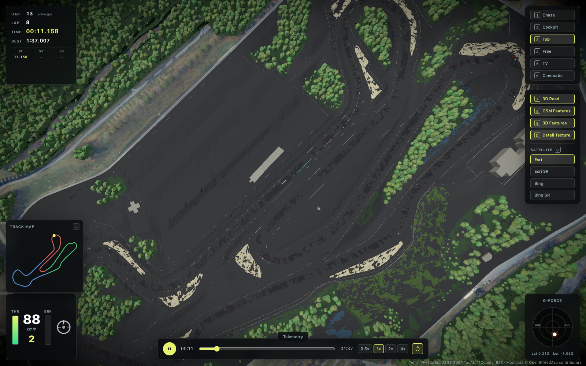
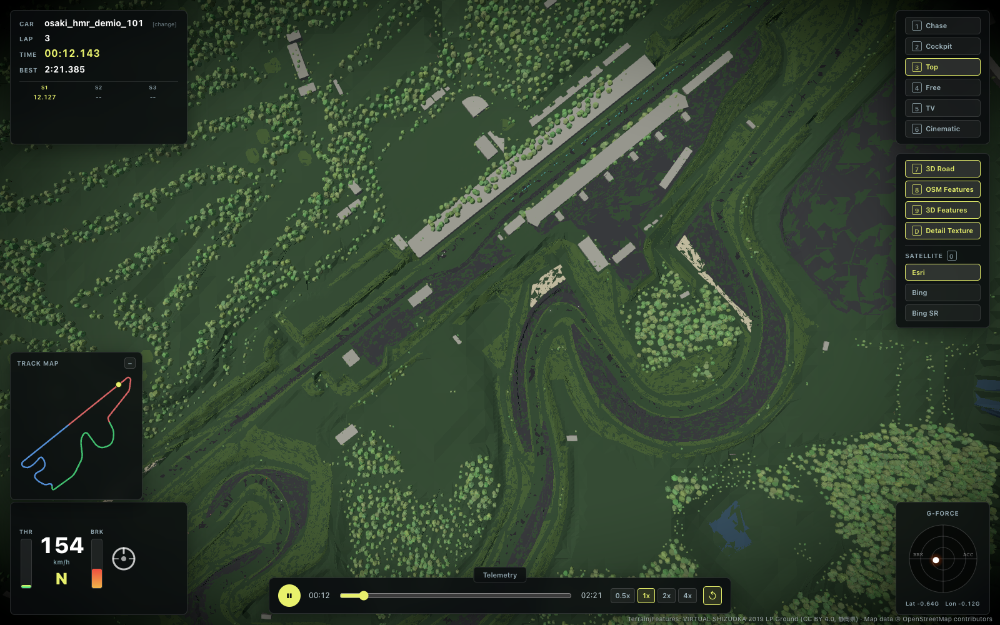

# P3c: 3Dフィーチャのコース回廊クリアランス — 実装レポート

仕様: `specs/p3c_track_clearance.md`
日付: 2026-07-06

## 概要

`pipeline/build_features3d.py` に track.json センターラインからの距離に基づく除外
(クリアランス)を追加し、コース上/直近に立っていた樹木を取り除いた。両トラックの
`features3d.json` を既存の点群・OSMキャッシュから再生成した(再ダウンロードなし)。

## 実装

- `load_centerline_xz()` — track.json の `centerline[].x/z`(ローカルXZ)を読み込む。
- `centerline_distance(px, pz, cxs, czs)` — 閉ループ・ポリラインへの各クエリ点の最短距離。
  クエリ点をnumpyでベクトル化し ~600本のセグメントをループ(ピークメモリ O(N))。純numpy・RNG不使用で決定的。
- 樹木除外: `d < width/2 + TREE_CLEARANCE_M + crownRadius` を除外。既定 8.0、CLI `--tree-clearance` で調整可。
- 建物除外: フットプリント頂点のいずれかが `d < width/2 + 2.0` なら除外(ピットビル等を消さないよう控えめ)。
- バリアは除外しない(コース際にあるのが正しい)。
- stdout に `trees removed by clearance: N` / `buildings removed by clearance: N`。
- `--self-test` に境界検証を追加(`run_clearance_self_test`): 合成直線センターライン + 既知距離で、
  直線距離・樹木境界(keep iff d≥17.0)・建物境界・セグメント端キャップを検証。

## 除外件数 / before-after

| track  | trees before | trees after | trees removed | buildings before | after | removed |
|--------|-------------:|------------:|--------------:|-----------------:|------:|--------:|
| barber | 6489         | 6487        | 2             | 13               | 13    | 0       |
| fuji   | 18100        | 18038       | 62            | 91               | 91    | 0       |

- barber は再生成前でも最短樹木距離が 17.5 m あり、コース上に樹木はほぼ無かった(境界付近の 2 本のみ除外)。
- fuji は最短樹木距離 0.1 m とコース上に多数存在しており、62 本を除外。
- 建物はどちらも0除外(width/2+2 の控えめな閾値によりピットビル等は保持)。
- バリア: barber 72 / fuji 0(変化なし・除外対象外)。

## 生成物 (sha256 先頭16桁)

- barber: trees 6487 / buildings 13 / barriers 72 — `103fd3ab6ebbac7d`
- fuji:   trees 18038 / buildings 91 / barriers 0 — `8a9d41f55b131309`

バックアップ(再生成前)は各トラックの `features3d.p3c-pre.bak.json` に保存。既存の `.bak` は上書きしていない。

## 検証

- `python3 pipeline/build_features3d.py --track <t> --self-test` — 投影 + クリアランス境界の両自己テスト通過。
- `npm run test` — 176 passed (15 files)。
- `npm run build` — 成功。
- ビューワ(ポート5200)でトップビュー(カメラキー3)のスクショを両トラック分取得:
  - `barber_top.png`
  - `fuji_top.png`
  いずれもコースの走行面上に樹木が無いことを目視確認(樹木はコース外周のみ)。

## スクリーンショット

## 決定性

Math.random 不使用。距離計算は純numpy。樹木配置の既存決定的ジッタ/キャップロジックは不変。
座標系は北=−Z / 東=+X を維持。
